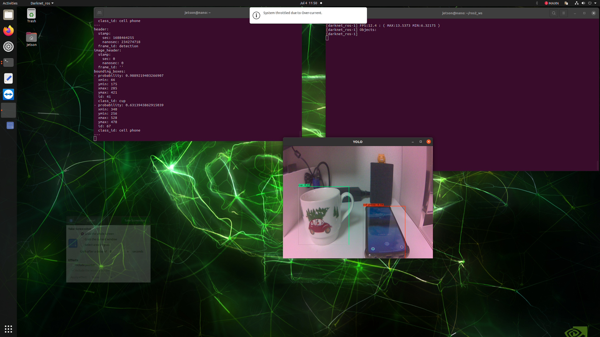

# darknet-ros-fp16

darknet_ros + ROS2 Foxy + OpenCV4 + CUDA 10 + __CUDNN (FP16)__ :fire::fire::fire:

- [English (GitHub Wiki)](https://github.com/Ar-Ray-code/darknet_ros_fp16/wiki/Darknet_ros_FP16-Report-(1.3x-faster)-%F0%9F%94%A5)
- [Japanese (zenn)](https://zenn.dev/array/articles/4c82fc8382e62d)

<br>

## Update

- May 1st 2022 Update
  - Support Ampere arch (including Jetson Orin)
- July 23th 2022 Update
  - Support YOLOv7-tiny

<br>

## Main changes

- __Support for YOLO v7__ : Switched the submodule to the master branch of [AlexeyAB/darknet.](https://github.com/AlexeyAB/darknet)
- __Removed IPL__ : Switched from IPL to CV::Mat for OpenCV4 support.
- __Support cuDNN + FP16__

<!-- ## Try on Docker :whale:

[DockerHub](https://hub.docker.com/r/ray255ar/darknet-ros-fp16) -->

<br>

## Requirements

- ROS2 (tested on Foxy)
- CUDA10 or later
  - If not, it will automatically turn off
- OpenCV
- CSI camera on Jetson Nano
- NVIDIA Graphics Card (Volta , Turing , Ampere)
- cuDNN (Ubuntu 20.04)

<br>


## Installation 🐢

### Installation

```bash
$ cd ~/ros2_ws/src
$ git clone --recursive https://github.com/zeta0707/darknet_ros_fp16.git
$ darknet_ros_fp16/darknet_ros/rm_darknet_CMakeLists.sh
$ cd ~/ros2_ws
$ colcon build --symlink-install
```

### Edit CMakeLists.txt

#### Options

When each option is turned off, the respective compile option will be disabled. This item is for benchmarking purposes, as it will be automatically disabled if the required libraries are not installed.

```cmake
set(CUDA_ENABLE ON)
set(CUDNN_ENABLE ON)
set(FP16_ENABLE ON)
```

#### cuDNN (FP16)

Darknet can be made even faster by enabling CUDNN_HALF(FP16), but you need to specify the appropriate architecture.

FP16 is automatically enabled for GPUs of the Turing or Ampere architecture if the appropriate cuDNN is installed. To disable it, change line 12 to `set(FP16_ENABLE OFF)`.

The Jetson AGX Xavier and TITAN V support FP16, but due to their Volta architecture, auto-detection is not possible. (Sorry... :( )

In that case, please comment out line 17 `set(CMAKE_CUDA_ARCHITECTURES 72)`

#### Download darknet weights

Since the weights to be downloaded are large, you can select the weights to be downloaded by the options.

```cmake
set(DOWNLOAD_YOLOV2_TINY OFF)　 # default : off
set(DOWNLOAD_YOLOV3 OFF)       # default : off
set(DOWNLOAD_YOLOV4 OFF)      　# default : off
set(DOWNLOAD_YOLOV4_CSP OFF) 　# default : off
set(DOWNLOAD_YOLOV4_TINY ON)  # default : on
set(DOWNLOAD_YOLOV4_MISH OFF)　# default : off
set(DOWNLOAD_YOLOV7_TINY ON)　 # default : on
```


### Demo


```bash
$ source /opt/ros/foxy/setup.bash
$ source ~/ros2_ws/install/local_setup.bash

# csi camera
$ ros2 launch darknet_ros yolov4-tiny.csi.launch.py
# usb camera
$ ros2 launch darknet_ros yolov4-tiny.usb.launch.py
```


## Performance

Using YOLO v4 consumes a lot of GPU memory and lowers the frame rate, so you need to pay attention.

### Test Machine

| Topics | Spec                                    |
| ------ | --------------------------------------- |
| CPU    | Jetson Nano                   |
| RAM    | 4G DDR                              |
| Driver | Jetpack 4.5                              |

### Performance (using cuDNN FP16)

YOLO v4-tiny : about 10 fps

<p align="center">
    
</p>


## Acknowledgment
 I am not a good programmer, but I was able to implement it with the help of many repositories. Thank you to [AlexeyAB](https://github.com/AlexeyAB)'s [darknet](https://github.com/AlexeyAB/darknet) , [legged robotics](https://github.com/leggedrobotics)'s [darknet_ros](https://github.com/leggedrobotics/darknet_ros), and [Tossy0423](https://github.com/Tossy0423/)'s [darknet_ros](https://github.com/Tossy0423/yolov4-for-darknet_ros/) !
